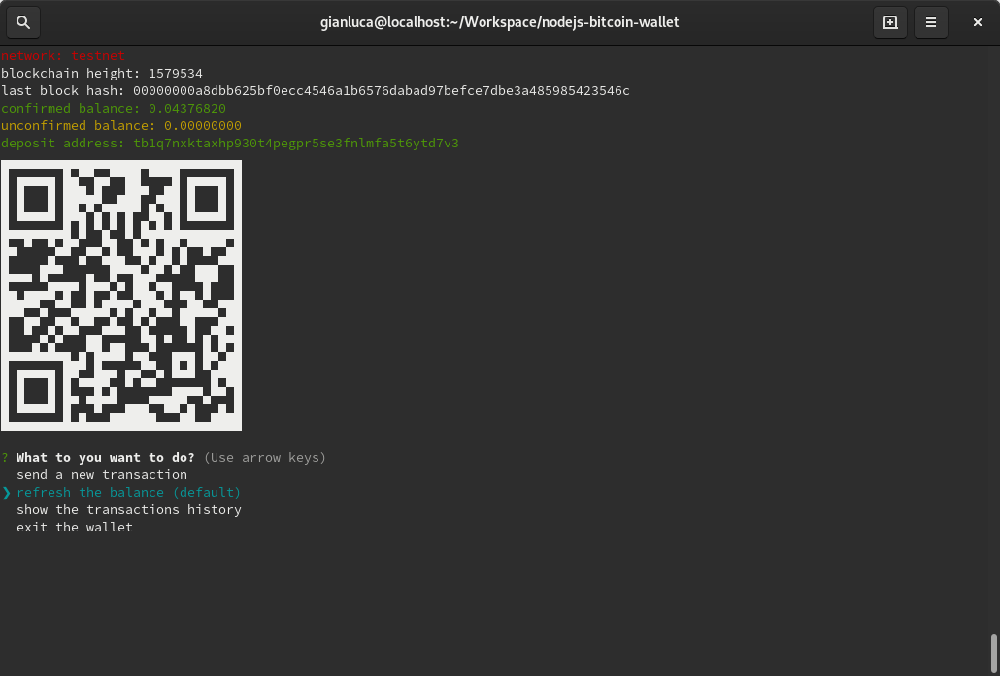

# nodejs bitcoin wallet




1. download

```
git clone https://github.com/gianlucamazza/nodejs-bitcoin-wallet.git
```

2. install dependencies

```
cd nodejs-bitcoin-wallet
npm install
```

3. copy the configuration file:

```
mv config.json.template config.json
```

4. run the wallet, if not present a bip32 wallet will be generated:
```
npm start
```
